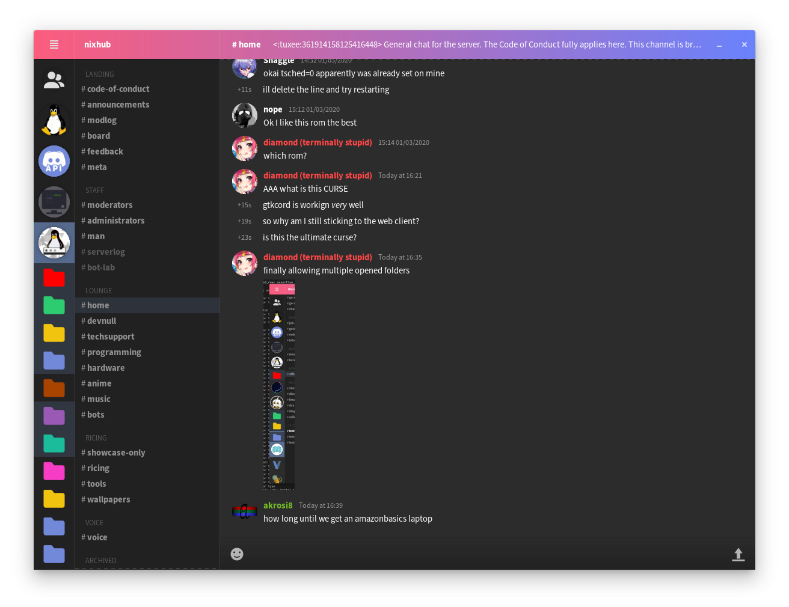

# gtkcord

A lightweight Discord client which uses GTK3 for the user interface.



## It's time to ditch the Discord Electron application (soon).

- Lighter than the official Discord application
- Faster than the official Discord application
- Uses less system resources than the official Discord application
- Is just as easy to use as the official Discord application
- Uses your prefered GTK theme

## Build gtkcord
**Required:** `go` (1.13+), `gtk`, `pkgconfig` (refer to `shell.nix`)

```sh
go get github.com/diamondburned/gtkcord3 # auto updates
~/go/bin/gtkcord3 # $GOPATH/bin/gtkcord3 or $GOBIN/gtkcord3
```

## Logging in


### Using DiscordLogin (recommended)

1. Click the DiscordLogin button.
2. Install DiscordLogin if you have to.
3. Login normally.

### Manually

1. Press F12 in when Discord is open (to open the Inspector).
2. Go to the Network tab then press F5 to refresh the page.
3. Search `api library` then look for the "Authorization" header in the right column.
5. Copy this token into the Token field, then click Login.

## (Missing) features

- See the messages of the selected channel
	- [ ] Message reactions
- Send messages
	- [ ] Emojis
	- [ ] Message reactions
- Graphical login
	- [ ] Graphical logout
- Hamburger menu
	- [ ] Change the visibility of your online state
		- [ ] Custom Rich Presence
		- [ ] Rich Presence IPC server
	- [ ] About dialog

## Low priority

- [ ] Options menu with the same options which Discord has
- [ ] Voice chat support

## Known Bugs/Limitations

- [x] Emojis always appear large
- [ ] Random crashes (very rare)
- [x] Thread (un)safety with Xorg/xcb
- [x] Rampant concurrency
- [x] Semaphore limits
