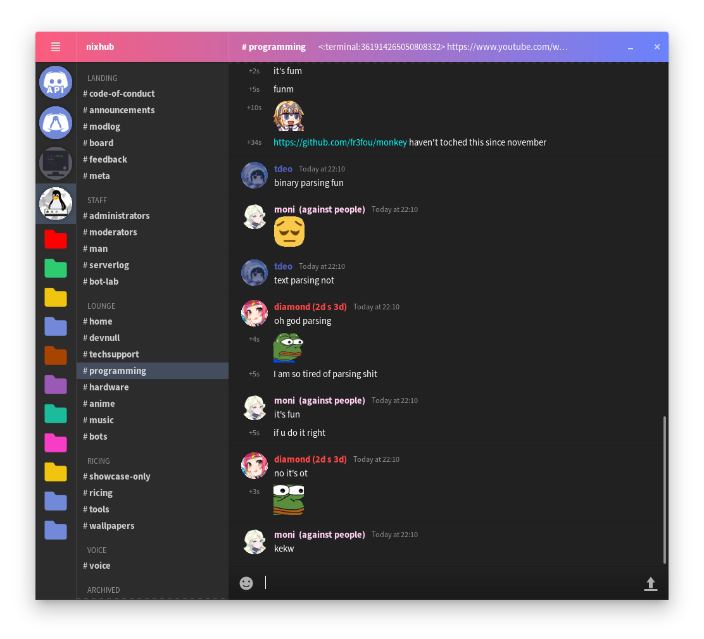
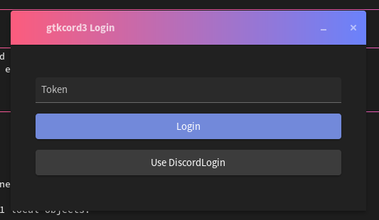

# gtkcord

A lightweight Discord client which uses GTK3 for the user interface.



## It's time to ditch the Discord Electron application (soon).

- Lighter than the official Discord application
- Faster than the official Discord application
- Uses less system resources than the official Discord application
- Is just as easy to use as the official Discord application
- Uses your prefered GTK theme

## Build gtkcord
**Required:** `go` (1.13+), `gtk`

```sh
export TOKEN="<your copied token here>"
go run .
```

## Logging in



### Using DiscordLogin (recommended)

1. Click the DiscordLogin button.
2. Install DiscordLogin if you have to.
3. Login normally.

### Manually

1. Press F12 in when Discord is open (to open the Inspector).
2. Press F5 to refresh the page and go to the Network tab.
3. Search `api library` then look for the "Authorization" header in the right column.
4. Copy this token.
5. Paste this token into the Token field, then click Login.

## Current features

- [X] See a list with Discord servers
	- [X] Folders
	- [X] Async loading
- [X] See a list of channels
	- [X] Server banner
	- [X] Async loading
- [X] See the messages of the selected channel
	- [X] Emojis
	- [X] Async loading
	- [ ] Message reactions
	- [X] Rich content
		- [X] Images
		- [x] Embeds
- [X] Send messages
  - [X] Text
  - [X] Images & files
	- [ ] Emojis
	- [ ] Message reactions
- [x] Graphical login
	- [ ] Graphical logout
- [X] Hamburger menu
	- [X] User avatar view
	- [ ] Change the visibility of your online state
		- [ ] Custom Rich Presence
		- [ ] Rich Presence IPC server
	- [ ] About dialog

## Low priority

- [ ] Options menu with the same options which Discord has
- [ ] Voice chat support

## Known Bugs/Limitations

- [x] Emojis always appear large
- [ ] Random crashes
- [x] Thread (un)safety with Xorg/xcb
- [x] Rampant concurrency
- [x] Semaphore limits
