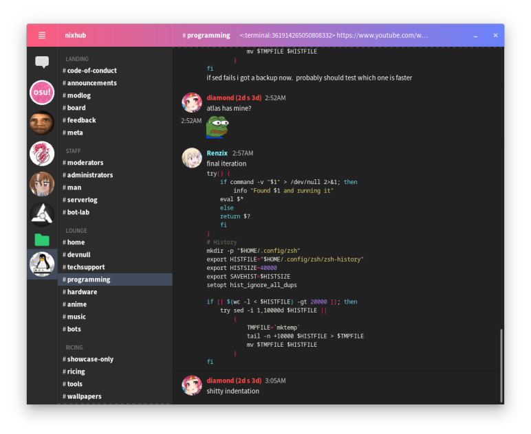

# GtkCord

A lightweight Discord client which uses GTK for the user interface.



## It's time to ditch the Discord Electron application.

GtkCord:
- Lighter than the official Discord application
- Faster than the official Discord application
- Uses less system resources than the official Discord application
- Is just as easy to use as the official Discord application
- Uses your prefered GTK theme

## Build GtkCord
**Required:** go, gtk

The developer of GtkCord is currently working on a login, so that you no longer need to set the TOKEN variable.

### 1. Set the TOKEN variable to your Discord key

You can find this key by:
- Press F12 in when Discord is open
- Press F5 to refresh the page and go to the network tab
- Search 'api library' and search for Authorization in the right column

```bash
EXPORT TOKEN=your-discord-key
```

### 2. Compile and run GtkCord
```bash
run go run .
```

## Current features
- [X] See a list with Discord servers
- [X] See a list of channels
- [X] See the messages of the selected channel
- [ ] Send messages
- [ ] React to messages
- [ ] Graphical login
- [ ] Options menu with the same options which discord has
- [ ] Change the visibility of your online state (invisible, away, online)
- [ ] Voice chat support